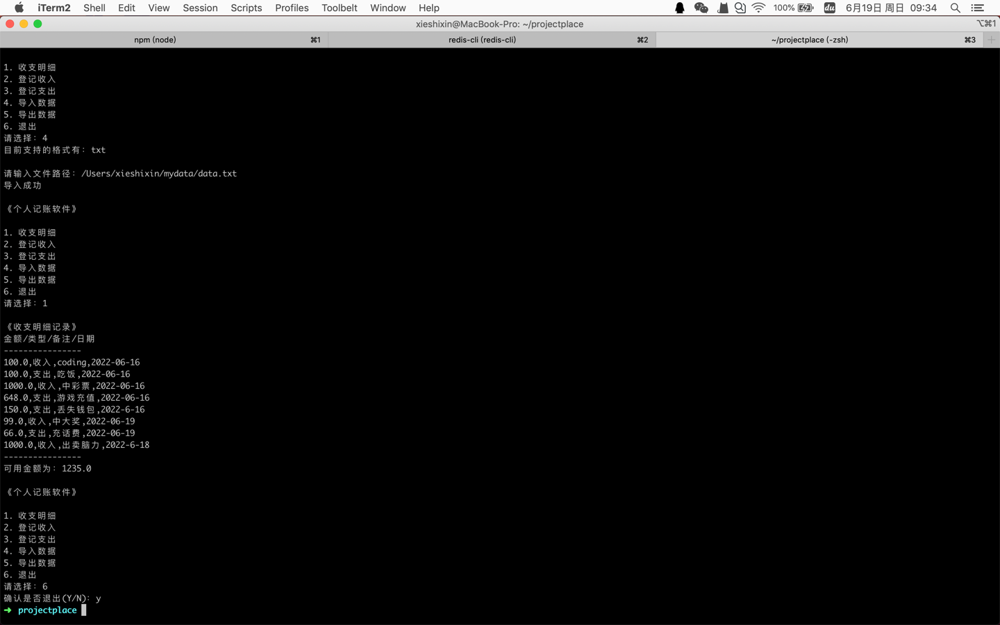

# 个人记账软件

基于JavaSE开发的命令行小工具，涵盖了面向对象、接口、反射、io流、泛型、集合等特性的应用，可用于java基础知识的复习。（项目参考于[尚硅谷Java入门](https://www.bilibili.com/video/BV1Kb411W75N)) 一阶段项目*家庭收支记账软件*)

## 运行

- 方式一：在idea的环境下，运行主类的（src/com/aojiaodage/Application）main方法
- 方式二：将项目打包后，以jar的形式运行（java -jar *.jar）

## 配置文件

> src/account.properties

属性说明

* **services** 
  
    服务完整类名，以逗号分割，类的顺序对应服务菜单的序号（+1），如果想继续拓展服务，在编写完服务类后，将完整包名 
  复制到此处即可

* **data-file**

    保存数据的文件路径（绝对路径）

## 已实现的服务功能

- **收支明细**
  
    列出已记录的收支数据
  
- **登记收入**

    登记收入明细，使用此服务需要填写金额和备注
  
- **登记支出**

    登记支出明细（同上）
  
- **导入数据**
    
    将指定文件中的数据导入程序。目前只实现了txt文件数据导入，并且需要注意的是，txt文件数据需要符合特定的格式，比如在目前的txt文件数据导入实现中，规定文件中每行有四列数据， 
  第一列表示金额，第二列表示金额类型，第三列表示金额的使用说明，最后一列表示日期，数据之间以分号相隔。其他文件格式的拓展：编写对应文件的实现类后（com.aojiaodage.importer.FileImporter），将该实现类注册到导入数据服务中（com.aojiaodage.service.impl.ImportService#fileImporterMap，
  以后缀名为key，实现类为value）
  
- **导出数据**
    
    目前只支持txt格式
    
- **退出**